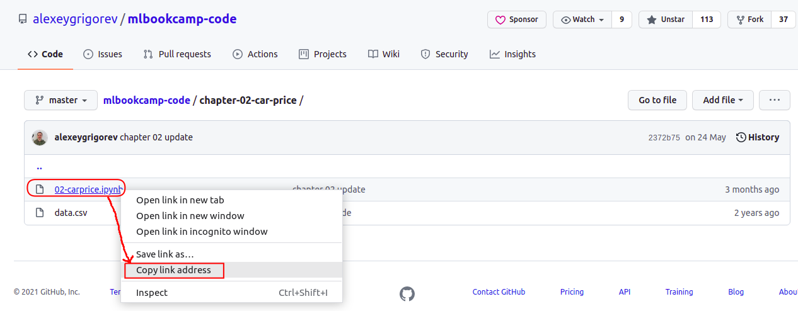
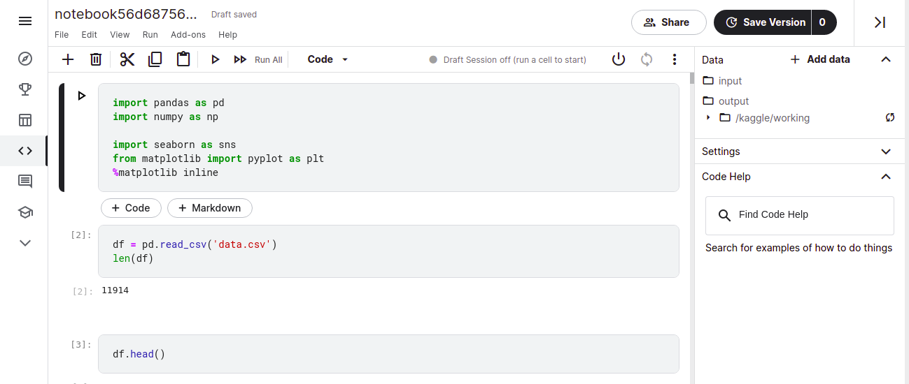
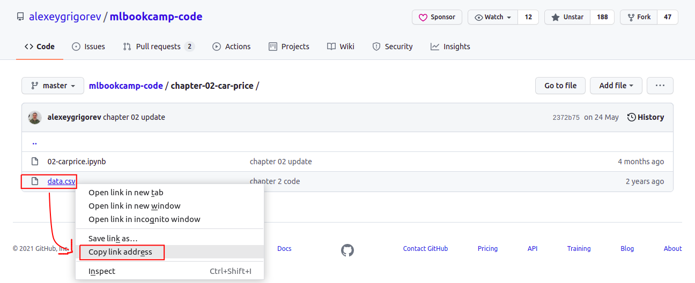
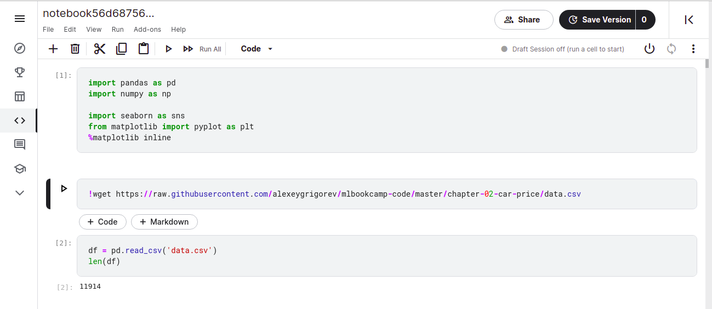

### Kaggle

To use Kaggle to open and run the Jupyter notebooks provided as part of this course do the following:

*Pre-requisites - You need to have an account in Kaggle (it's free) and be logged into Kaggle*

1. Find the URL of the notebook. 
   
   
   
2. To open the notebook in Kaggle, in your web browser launch paste the URL as shown in below example. (*note the additional https://kaggle.com/kernels/welcome?src= before the URL of the notebook*)

   https://kaggle.com/kernels/welcome?src=https://github.com/alexeygrigorev/mlbookcamp-code/blob/master/chapter-02-car-price/02-carprice.ipynb
  
3. Check if the notebook uses any datafile to read data from it. If yes, note the datafile name from the code.- *look for pd.read_csv("somefilename.csv")*. 
   
   
   
4. You need to download the file into Kaggle. For this:

   a. Find the URL of the datafile in github. 
   
   
   
   b. Suppose the URL is https://github.com/alexeygrigorev/mlbookcamp-code/blob/master/chapter-02-car-price/data.csv , you need use the URL to raw file, which will look something like https://raw.githubusercontent.com/alexeygrigorev/mlbookcamp-code/master/chapter-02-car-price/data.csv
   
5. In the notebook opened in Kaggle, add a Code block with the command to download the file - !wget your-datafile-url 

   
   
This way you can start with the exercise using Kaggle

### Google Colab

To use Google Colab to open and run the Jupyter notebooks provided as part of this course do the following:

*Pre-requisites - You need to have a google account (any gmail account) and be logged into that account*

Steps for Google Colab are same as that for Kaggle, except for some changes in Step 2, as explained below.

2. To open the notebook in Google Colab, in your web browser launch paste the URL as shown in below example. (*note the https://github.com/ in the URL of the notebook is replaced by https://colab.research.google.com/github/*)

   https://colab.research.google.com/github/alexeygrigorev/mlbookcamp-code/blob/master/chapter-02-car-price/02-carprice.ipynb
